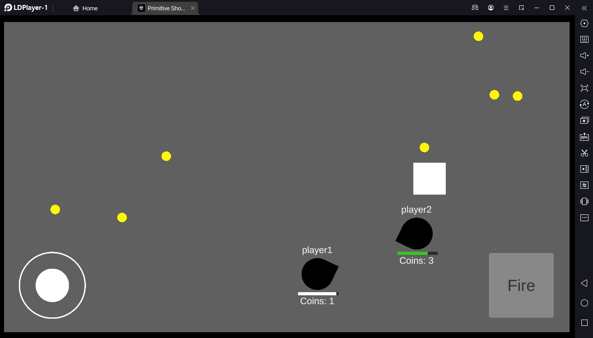
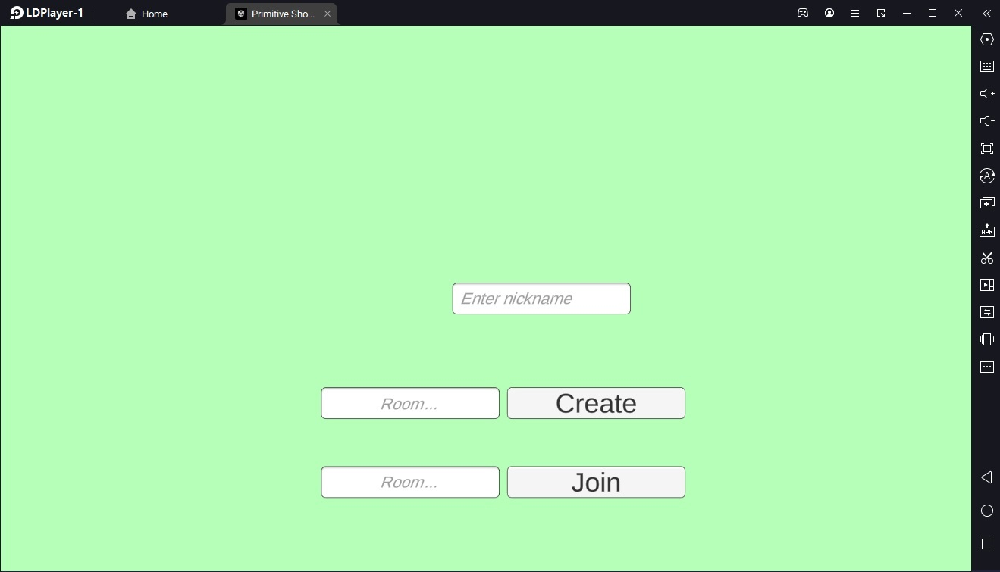
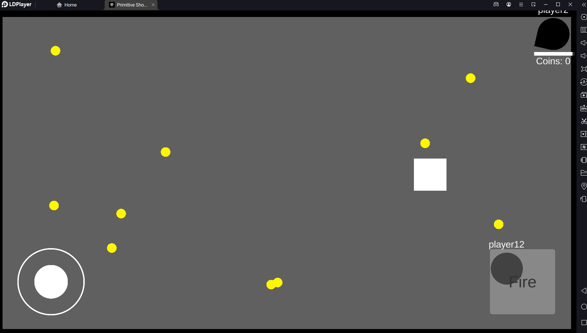

# Test Task 7tam.net(СтэмБАЙ) Unity разработчик (multiplayer)


Тестовое задание на вакансию Unity разработчик (multiplayer), в котором было необходимо реализовать в Unity Unity 2021.3.9f1 2D мультиплеерный шутер на любом из сетевых движков или написав свой.



При реализации должно было существовать три сцены: Loading, Lobby, Game. В лобби должна быть возможность создать или войти в комнату через текстовые поля. 
Игровой процесс заключается в сборе процедурно генерируемых на карте монет и стрельбе по противнику. Победа должна была наступать после уничтожения всех игроков. 



Реализовано: Загрука, Лобби, заход в игру несколькими игроками, хождение, поворот, стрельба стрельба через LIST боеприпасов в направлении ходьбы, шкалы здоровья и сбор монет через онлайн-движок Photon Engine. Смерть игроков(убирание "клюва и свободы движения") после смерти.
Был реализован билд на эмулятор LDPlayer(эмулятор Android).

Не реализовано: корректное отображение всех монет для всех игроков, задание стрельбы через LIST приводило к тому, что видно было противнику лишь первое появление снаряда, в другие разы он не считал его за префаб и не сталкивался с ним.



На собеседование был приглашен, рекуртер не ответил в соцсети, в которой же он попросил написать.

Сам текст тестового задания представлен ниже:

```
Задача

● Создать 2D игру для Android на Unity, где 2 и более игроков с
разных Android устройств смогут зайти в лобби;
● Обязательно использовать следующую версию Unity 2021.3.9f1.

Требования к игре
Сцены
● В игре должны присутствовать 3 сцены: Loading, Lobby, Game.
Описание стека технологий
● Для выполнения задания можно использовать любой бесплатный
сетевой движок и облачный сервис для создания масштабируемых
кроссплатформенных многопользовательских игр.
Лобби
● В лобби должна быть возможность создать комнату и войти в неё,
а также подключиться к комнате, уже созданной другим игроком.
Сцена лобби: есть два поля с кнопками, в одно поле игрок может
написать название комнаты, а затем нажать кнопку “Создать”, в
другом поле игрок пишет название созданной комнаты, нажимает
кнопку "Войти" и ждет, когда на другом девайсе другой игрок
войдет в комнату с тем же названием.
Игровой процесс
● После входа в комнату игроки попадают на боевой сервер и
начинается игровой процесс. Есть поле, ограниченное размером
экрана, на нем разбросаны лутабельные монеты, которые каждый
игрок может собрать;
● Когда на игровом поле появляются минимум 2 игрока, каждый из
них имеет способность поворачиваться и перемещаться в
определенную сторону, а также стрелять в том направлении куда
смотрит. Для управления игроком используется экранный
виртуальный джойстик;
● Игрок имеет полосу здоровья и шкалу сбора монет;

● Если в игрока попадает снаряд, который выпустил другой игрок,
шкала здоровья уменьшается;
● Игроки должны визуально отличаться друг от друга (имя, цвет или
изображение);
● Игра заканчивается, когда в живых останется 1 игрок. После этого
появляется победный pop-up с информацией, где указаны имя
победителя и сколько монет он собрал.

Что будет оцениваться
● Завершённость игры;
● Удобство игры с телефона;
● Чистота и аккуратность кода;
● Зависимости между классами;
● Структура проекта в Unity;
● Оформление репозитория;
● Коммуникабельность и умение работать с заказчиком (нами).

Сроки выполнения

● До 3 дней. Время начинает свой отсчет в момент начала работы
над тестовым заданием.

```